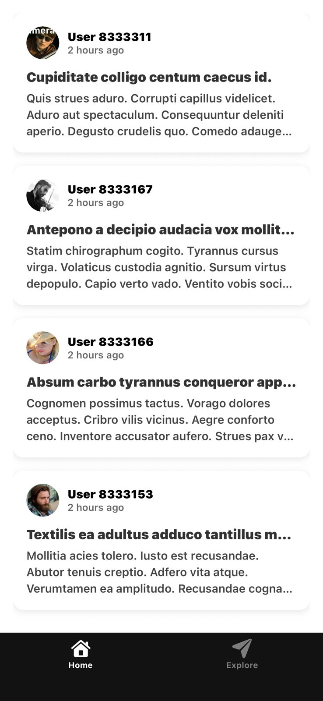
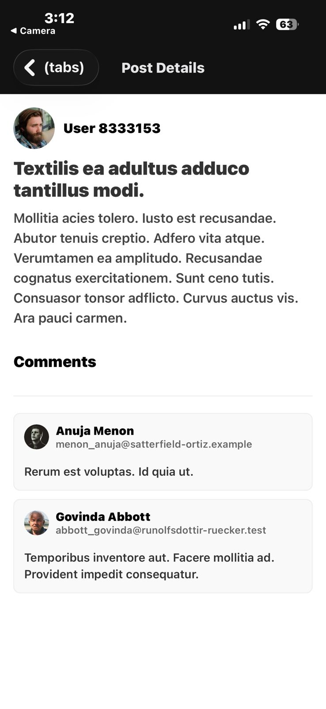

# Social Mobile Application

A React Native mobile application built with **Expo** and **TypeScript**. This app fetches data from the GoRest API to display a feed of user posts and allows users to view post details and comments.

## 📱 Features

* [cite_start]**Home Screen:** Fetches and displays a list of posts from `gorest.co.in`[cite: 31].
* [cite_start]**Post Details:** Tap any post to view the full content, user details, and a list of comments[cite: 36, 37].
* [cite_start]**UI/UX:** Custom cards with user avatars (generated via Pravatar) and clean navigation[cite: 53].

## 🛠 Tech Stack

* [cite_start]React Native (Expo Go) [cite: 52]
* [cite_start]TypeScript [cite: 60]
* Expo Router (File-based routing)

##  Screenshots

| Home Screen | Post Details |
|:---:|:---:|
|  |  |

##  How to Run

1.  **Clone the repository**
    ```bash
    git clone [https://github.com/AnasJabrr/Hiryo-Internship_React-Native-Task.git]
    cd my-social-app
    ```

2.  **Install dependencies**
    ```bash
    npm install
    ```

3.  **Start the app**
    ```bash
    npx expo start
    ```

4.  **Run on Device**
    * Scan the QR code with the **Expo Go** app (Android) or Camera app (iOS).

## ⏱ Time Taken

[cite_start]**Total Time:** 6-7 hours


---
*Task completed for internship evaluation.*